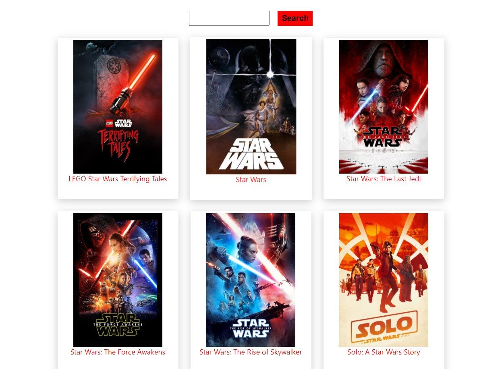
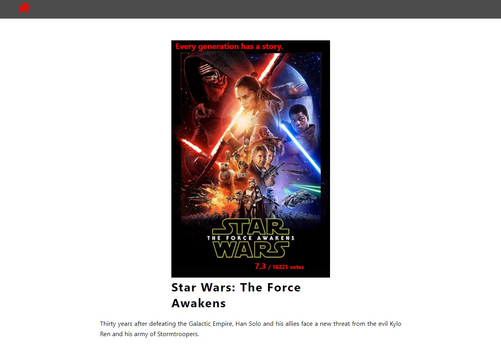

# React - Movie Database

[This project](https://gurhanalan.github.io/React-MovieDatabase-Project/) is two page website of Moviedatabase. You can search movies and see the details of movies.

## Table of contents

- [React - Movie Database](#react---movie-database)
  - [Table of contents](#table-of-contents)
  - [Overview](#overview)
    - [The challenge](#the-challenge)
    - [Screenshots](#screenshots)
    - [Links](#links)
  - [My process](#my-process)
    - [Built with](#built-with)

## Overview

### The challenge

Users should be able to:

-   View the optimal layout for the app depending on their device's screen size
-   See hover states for all interactive elements on the page
-   Search Movies
-   See movie details
<!-- -   Change the position, color, shape and size of a box by click the control buttons. -->

### Screenshots

 
 
 

<!--  -->

### Links

-   Solution URL: [Live Website](https://gurhanalan.github.io/React-MovieDatabase-Project/)

## My process

### Built with

-   React
-   Functional Components
-   Styled Components
-   React Hooks (useRef, useState, useContext, useEffect)
-   Axios - API
